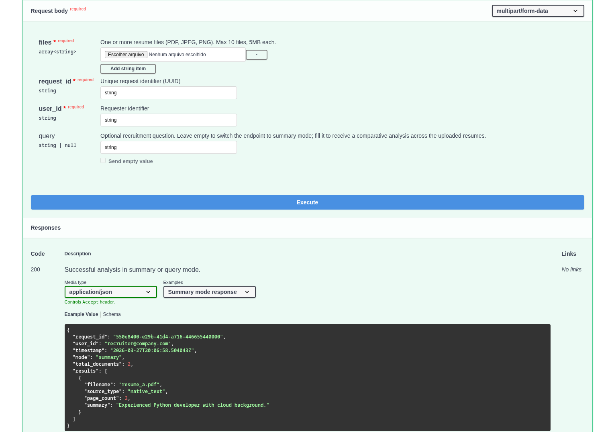
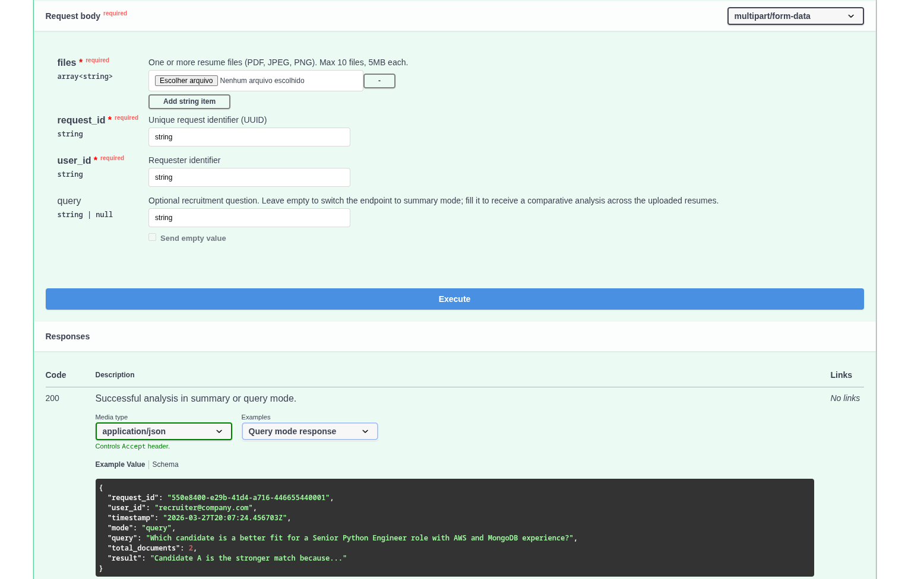

# AI Resume Analyzer

[](https://github.com/CFBruna/ai-resume-analyzer/actions/workflows/ci.yml)


AI-powered resume analysis platform for recruitment teams. Upload PDF or image resumes and receive structured summaries or ask recruitment questions answered with evidence-based justifications.

## Quick Start

```bash
cp .env.example .env
docker compose up --build
```

> Note: this project was validated on Linux/Fedora. Windows users can run it with Docker Desktop, but some shell commands may need small adjustments.

⚠️ First startup can take 5-12 minutes.

The first run downloads the LocalAI image and the LLM model (`llama-3.2-1b-instruct:q4_k_m`), so please wait for it to finish before testing the API.

## 3 Steps To Test

1. Start the stack

```bash
docker compose up --build
```

2. Open Swagger

```text
http://localhost:8000/docs
```

3. Send a request

```bash
curl -X POST http://localhost:8000/api/v1/resumes/analyze \
  -F "files=@resume.pdf" \
  -F "request_id=550e8400-e29b-41d4-a716-446655440000" \
  -F "user_id=recruiter@company.com"
```

## Endpoints

- `GET /health`
- `POST /api/v1/resumes/analyze`

## API Usage

### Summaries

```bash
curl -X POST http://localhost:8000/api/v1/resumes/analyze \
  -F "files=@resume.pdf" \
  -F "request_id=550e8400-e29b-41d4-a716-446655440000" \
  -F "user_id=recruiter@company.com"
```

### Query

```bash
curl -X POST http://localhost:8000/api/v1/resumes/analyze \
  -F "files=@resume_a.pdf" \
  -F "files=@resume_b.pdf" \
  -F "request_id=550e8400-e29b-41d4-a716-446655440001" \
  -F "user_id=recruiter@company.com" \
  -F "query=Which candidate has more Python and cloud experience?"
```

## Swagger Preview

Summary mode:



Query mode:



## LLM Provider

The adapter selects the provider via `LLM_PROVIDER`. To switch from LocalAI to OpenAI-compatible endpoints, update only these env vars:

```env
LLM_PROVIDER=openai
LLM_BASE_URL=https://api.openai.com/v1
LLM_API_KEY=sk-your-key
LLM_MODEL=gpt-4o-mini
```

Default note: the repository uses `llama-3.2-1b-instruct:q4_k_m` because it starts fast and is a good demo default, but you can swap it in `.env` without changing code.

## Recommended Models

The model is configurable and can be swapped without code changes.

| Model | RAM | Quality | Notes |
|---|---:|---|---|
| `llama-3.2-1b-instruct:q4_k_m` | ~1.5GB | Demo | Default, fast startup |
| `mistral-7b-instruct:q4_k_m` | ~5GB | Good | Recommended for real use |
| `qwen2.5-7b-instruct` | ~5GB | Best PT/EN | Bilingual accuracy |

## Architecture

- `domain/` entities and ports
- `application/` use cases
- `infrastructure/` OCR, LLM and persistence adapters
- `presentation/` FastAPI routes, schemas and DI

## OCR Choice

EasyOCR was chosen for this challenge because it works well with scanned resumes and keeps the setup simple. The architecture stays open to swapping in Tesseract or PaddleOCR later if needed.

## Local URLs

- Swagger: http://localhost:8000/docs
- Redoc: http://localhost:8000/redoc
- Health: http://localhost:8000/health
